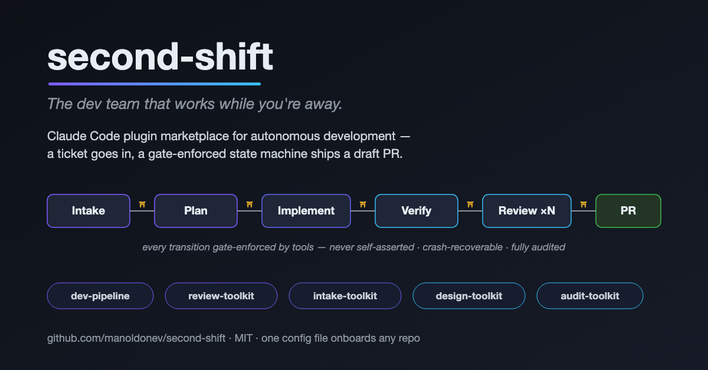

<p align="center">
  
</p>

# second-shift

> The dev team that works while you're away.

**second-shift** is a [Claude Code](https://claude.com/claude-code) plugin marketplace for orchestrating autonomous development. Point it at a ticket and it runs the full loop — intake, planning, implementation, verification, multi-agent code review, and a draft PR — as a crash-recoverable state machine inside a single local session. Adopt the whole pipeline, or just the pieces you want (parallel review, structured intake interviews, design-fidelity checks, session auditing).

## Why

Agent-assisted development gets dramatically better when the *process* is engineered, not improvised: gates that fail closed instead of self-asserted claims, review by a panel of specialized reviewers instead of one generalist pass, plans whose load-bearing decisions were elicited from you instead of assumed, and an audit trail of what the agent actually did. second-shift packages that process discipline as installable plugins, with a strict boundary between the generic machinery (here) and everything specific to your repo (one config file + optional knowledge files in your repo).

## Plugins

| Plugin | What you get |
| --- | --- |
| **dev-pipeline** | Ticket → PR in 10 gated stages. Resumable state machine (`statectl`), deterministic verify runner (`verifyctl`), plan lint with acceptance-criteria traceability, tracker adapters (GitHub Issues with bot-identity claiming, or read-only JIRA), cost tracking, post-run retrospective. |
| **review-toolkit** | `review-lead` parallel multi-agent review: security, performance, maintainability, complexity, db, scope-completeness, test-coverage reviewers under a shared confidence protocol; mutation-review of unit tests; commit-time consistency gates. |
| **intake-toolkit** | The elicitation surface: `/intake-toolkit:intake` front door, requirement and decomposition interviews, `plan-interview` that turns design decisions into a machine-lintable Decision Ledger, `grill-me` plan stress-testing. |
| **design-toolkit** | Design-fidelity translation and review (`design-faithful`), with an optional Figma-MCP-backed mode (`figma-faithful`), plus a Playwright CLI helper. |
| **audit-toolkit** | A per-repo tool-call audit ledger (what the agent *actually* invoked), with `/audit-toolkit:audit` and cross-session history queries. |

Each plugin ships its own selftests and evals; the marketplace CI is fully model-free (shellcheck, selftests, schema fixtures).

## Quick start

Requirements: Claude Code ≥ 2.x, `bash`, `jq`, `git`; `gh` CLI for the GitHub tracker; an Atlassian MCP connection for the JIRA tracker; a Figma MCP only if you enable the figma gate.

```text
# 1. in Claude Code
/plugin marketplace add manoldonev/second-shift
/plugin install dev-pipeline@second-shift      # and/or review-toolkit, intake-toolkit, ...
```

```jsonc
// 2. describe your repo — .claude/second-shift.config.json (this is ALL the setup)
{
  "configVersion": 1,
  "tracker": { "type": "github" },
  "topology": { "type": "standalone", "repos": { "app": { "path": ".", "baseBranch": "main" } } },
  "commands": { "app": { "lint": "yarn lint", "typecheck": "yarn tsc --noEmit", "test": "yarn test" } }
}
```

```text
# 3. validate, then run it on a small ticket — autonomous is the only mode you need
bash <dev-pipeline plugin root>/tools/config-lint.sh .claude/second-shift.config.json
/dev-pipeline:run <ticket>
```

Full onboarding — topologies (monorepo, BE+FE pair), the JIRA tracker, reviewer tuning, extension files — in [`docs/onboarding.md`](docs/onboarding.md). To keep collaborators on the same toolset, pin a release in `.claude/settings.json` (`extraKnownMarketplaces` + `enabledPlugins`); track latest only in a canary.

## How it stays generic

Everything repo-specific lives in **your** repo, discovered through two documented contracts:

- **Static context** — one machine-readable config file: tracker, repo topology, base branches, command truth table, reviewer registry deltas (including per-reviewer model tiers), feature gates. Schema + lint shipped with the plugins.
- **Dynamic context** — optional knowledge files the agents load when present: domain blocker-mutants for test review, domain security rules, design-system token references, doc-routing maps. Missing file = generic behavior, so adoption is incremental.

The full taxonomy — what goes in config vs knowledge files vs run state, and the direction rule that keeps them apart — is in [`docs/context-model.md`](docs/context-model.md). The extension surface is specified in [`docs/extension-points.md`](docs/extension-points.md), namespacing rules in [`docs/namespaces.md`](docs/namespaces.md).

## Design principles

- **Local-first, subscription-first.** The core path is one interactive session on your machine. Nothing requires API-billed cloud surfaces; anything that would is a config gate, off by default.
- **Gates over vibes.** Stage completion is enforced by tools (`statectl`, `verifyctl`, plan/ledger/config lint, commit hooks), not by the model asserting success. Optional gates fail closed when their prerequisites are missing.
- **Nothing repo-specific in the plugins.** If two adopters would differ on a value it's config; if they'd differ in knowledge it's an extension file. This boundary is CI-enforced where it can be.
- **Selftests everywhere.** Every shell tool ships a selftest; CI runs them all, model-free.

## Docs

[`onboarding.md`](docs/onboarding.md) · [`extending.md`](docs/extending.md) · [`config-schema.md`](docs/config-schema.md) · [`context-model.md`](docs/context-model.md) · [`extension-points.md`](docs/extension-points.md) · [`namespaces.md`](docs/namespaces.md) · [`native-primitive-audit.md`](docs/native-primitive-audit.md)

## License

MIT
