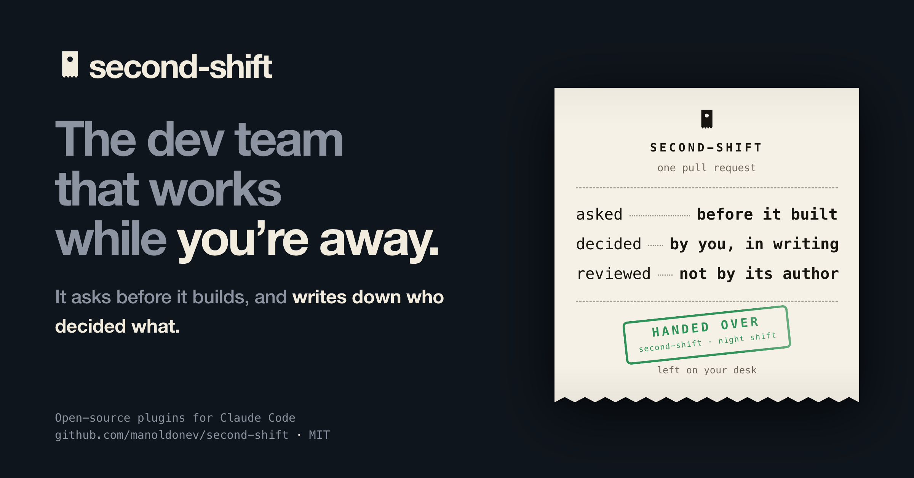

<p align="center">
  
</p>

# second-shift

> The dev team that works while you’re away.
>
> *It asks before it builds, and writes down who decided what.*

**second-shift** asks, builds and reviews. Before the agent builds, it puts the open design decisions to you one at a time and records your answers in the spec. It then takes the ticket to a pull request, and a separate session, not the one that wrote the code, reviews it against those answers and posts its verdict on the PR. Every install gets both records: the decisions you made, committed as the branch's first commit, and a review its author did not write. Opt-in: a render check of each designed screen when a design provider is configured. The merge button stays yours.

## Get started

Requirements: Claude Code ≥ 2.x, `bash`, `jq`, `git`, `node` (the review and intake Workflows run under it), and the `gh` CLI — the build session opens PRs via `gh pr create` for **every** tracker, JIRA runs included. Tracker extras: an Atlassian MCP connection for the JIRA tracker; a Figma MCP only if you set `design.provider` to `figma`. GitHub tracker: the queue labels, and optionally a GitHub-App bot identity for the lane's own writes ([`docs/onboarding.md`](docs/onboarding.md)).

Onboarding is three commands and one skill invocation:

```bash
# 1. Register the marketplace and install the bootstrap plugin (once per machine)
claude plugin marketplace add manoldonev/second-shift
claude plugin install second-shift@second-shift        # user scope — bootstraps everything else

# 2. Start a Claude Code session inside the repo you want to onboard
cd ~/code/your-repo
claude
```

```text
# 3. Inside that session, type:
/second-shift:onboard
```

`onboard` detects your tracker and command truth table with provenance, shows one accept-or-edit screen, and writes the config, the pinned settings block and the lockfile — validated with `config-lint` in-loop — plus a short `.claude/SECOND-SHIFT.md` that tells collaborators what was installed. It finishes by telling you which plugins to install and reminding you to restart the session (plugin registration happens at session start).

```jsonc
// What onboard writes (the config is still yours to edit) — .claude/second-shift.config.json
{
  "configVersion": 3,
  "tracker": { "type": "github" },
  "commands": { "your-repo": { "lint": "yarn lint", "typecheck": "yarn tsc --noEmit", "test": "yarn test" } }
}
```

Then pick a small, self-contained ticket. Ask first: intake puts the ticket's open decisions to you one at a time and records your answers. On the GitHub tracker it also queues the ticket with the `ready-for-dev` label, and the lane refuses a ticket without it (exit 3, `not-queued`). Then let the pipeline run it — autonomous is the only mode you need. The front door is a scheduler: it claims the ticket, commits the intake record as the branch's first commit, then runs rounds of a fresh build session, the configured checks (run by the scheduler, not by the build) and a fresh review session, until a review approves the current head or a budget is spent.

```text
/intake-toolkit:intake <ticket>
/dev-pipeline:run <ticket>
```

The review posts one PR comment: `verdict: approve` or `verdict: needs-work`, the head it reviewed, a table scoring every row of the record, then findings. The scheduler accepts it only if it was posted during that review session, by a Bot or the account the scheduler writes with, never edited, and names the current head. When a run ends without a usable verdict, review by hand from a fresh session:

```text
/dev-pipeline:review <pr>
```

Full onboarding — reviewer tuning, extension files, the optional bot identity — is in [`docs/onboarding.md`](docs/onboarding.md); the JIRA tracker's setup and behavioral delta live in [the JIRA tracker README](plugins/dev-pipeline/tools/tracker/jira/README.md). To keep collaborators on the same toolset, commit the settings pin `onboard` writes (`extraKnownMarketplaces` + `enabledPlugins` in `.claude/settings.json`); track latest only in a canary.

## Why

Agents write plausible code faster than a team can honestly review it, so the bottleneck moved from writing to deciding. second-shift starts with the asking: open decisions go to you one at a time and land in a Decision Ledger the build works from, instead of being guessed. The review then runs in a session that did not write the code and scores the change against every recorded decision, so what was decided and what was judged are both on record. An audit ledger records what the agent actually invoked. The generic machinery lives here; everything specific to your repo lives in your repo.

## Plugins

| Plugin | What you get |
| --- | --- |
| **dev-pipeline** | An intaken ticket → a reviewed PR: `/dev-pipeline:run` is a scheduler over fresh build and review sessions that runs the checks itself, caps rounds, check reds, time and cost, and accepts only a verdict bound to the current head. `/dev-pipeline:review` is the manual review; `pr-revision` answers human PR comments. Tracker adapters (GitHub Issues with label claiming, optionally through a bot identity, or read-only JIRA); a cost block on the PR. |
| **review-toolkit** | `review-lead` parallel multi-agent review — scope-completeness, security, performance, maintainability, complexity, db, pipeline, a11y, test-coverage and unit-test-mutation reviewers under a shared confidence protocol; commit-time consistency gates. On the pipeline path `/dev-pipeline:review` dispatches scope-completeness only; the rest are opt-in per ticket (a `review panel` Decision Ledger row) or per repo (`reviewers.default` in the config). Standalone `review-lead` routes by what the diff touches. |
| **intake-toolkit** | The elicitation surface: `/intake-toolkit:intake` front door, requirement and decomposition interviews, `plan-interview` that turns design decisions into a machine-lintable Decision Ledger, `grill-me` plan stress-testing. |
| **design-toolkit** | Design-fidelity translation and review (`design-faithful`), with an optional Figma-MCP-backed mode (`figma-faithful`) and `figma-iterate` — an interactive fast-path for quick Figma iteration that swaps pipeline ceremony for one batched discrepancy checkpoint. |
| **audit-toolkit** | A per-repo tool-call audit ledger (what the agent *actually* invoked), with `/audit-toolkit:audit` and cross-session history queries. Installed alongside dev-pipeline. |
| **second-shift** | Onboarding + health for the marketplace itself: `/second-shift:onboard` writes your repo's config, settings pin, and lockfile from provenance-first detection; `/second-shift:doctor` verifies install state against the lockfile. Install at user scope; it bootstraps everything else. |

Each plugin ships its own selftests and evals; the marketplace CI is fully model-free (shellcheck, selftests, schema fixtures). The supported install is the full suite pinned to a release tag (`/second-shift:onboard` writes exactly that); review-only is a documented, community-supported downgrade.

## How it stays generic

Everything repo-specific lives in **your** repo, discovered through two documented contracts:

- **Static context** — one machine-readable config file: tracker, command truth table, reviewer registry deltas (including per-reviewer model tiers), design render commands, run caps. Schema + lint shipped with the plugins.
- **Dynamic context** — optional knowledge files the agents load when present: domain blocker-mutants for test review, domain security rules, design-system token references, doc-routing maps. Missing file = generic behavior, so adoption is incremental.

The full taxonomy — what goes in config vs knowledge files vs run state, and the direction rule that keeps them apart — is in [`docs/context-model.md`](docs/context-model.md). The extension surface is specified in [`docs/extension-points.md`](docs/extension-points.md), namespacing rules in [`docs/namespaces.md`](docs/namespaces.md).

## Design principles

- **Local-first, subscription-first.** The core path is one interactive session on your machine. Nothing requires API-billed cloud surfaces; anything that would is a config gate, off by default.
- **Build and review never share a session.** The verdict is written by a session that did not write the code, and the lane never merges its own PR.
- **Gates over vibes.** The scheduler runs the checks itself and accepts only a verdict bound to the current head; ledger and config lint and commit hooks do the rest. A build's word that it is green counts for nothing, and a check that cannot run fails closed.
- **Nothing repo-specific in the plugins.** If two adopters would differ on a value it's config; if they'd differ in knowledge it's an extension file. This boundary is CI-enforced where it can be.
- **Selftests everywhere.** Every shell tool is exercised by a selftest; CI runs them all, model-free.

## Docs

[`onboarding.md`](docs/onboarding.md) · [`team-rollout.md`](docs/team-rollout.md) · [`extending.md`](docs/extending.md) · [`config-schema.md`](docs/config-schema.md) · [`context-model.md`](docs/context-model.md) · [`extension-points.md`](docs/extension-points.md) · [`namespaces.md`](docs/namespaces.md) · [`releasing.md`](docs/releasing.md) · [`migrations/`](docs/migrations/README.md) · [`CHANGELOG.md`](CHANGELOG.md)

## License

MIT
