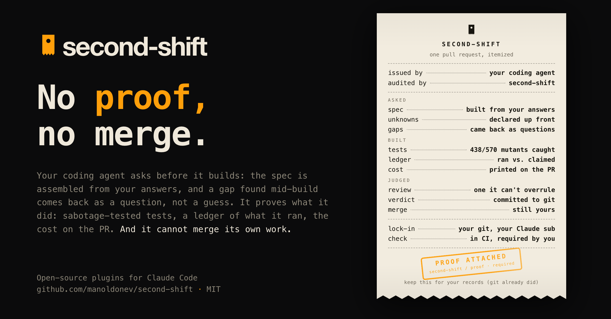

<p align="center">
  
</p>

# second-shift

> No proof, no merge.

**second-shift** is a set of open-source [Claude Code](https://claude.com/claude-code) plugins for autonomous development. Your coding agent takes a ticket and writes the pull request. What decides whether that PR ships is not the agent's word: a review from a session that did not write the code, tests that survived deliberate sabotage, a record of what the agent actually ran, and a merge check in CI that reads those records and refuses when any is missing. The cost of the run is printed on every PR. The merge button stays yours.

It runs on the Claude Code subscription you already pay for, in your repo, in plain git. One config file onboards a repo; the plugins hold nothing repo-specific.

## Get started

Requirements: Claude Code ≥ 2.x, `bash`, `jq`, `git`, `node` (the review and mutation Workflow gates run under it), and the `gh` CLI — the build block opens PRs via `gh pr create` for **every** tracker, JIRA runs included. Tracker extras: an Atlassian MCP connection for the JIRA tracker; a Figma MCP only if you enable the figma gate.

Onboarding is three commands and one skill invocation:

```bash
# 1. Register the marketplace and install the bootstrap plugin (once per machine)
claude plugin marketplace add manoldonev/second-shift
claude plugin install second-shift@second-shift        # user scope — bootstraps everything else

# 2. Start a Claude Code session inside the repo you want to onboard
cd ~/code/your-repo
claude
```

```text
# 3. Inside that session, type:
/second-shift:onboard
```

`onboard` detects your tracker, topology, and command truth table with provenance, shows one accept-or-edit screen, and writes three files — the config, the pinned settings block, and the lockfile — validated with `config-lint` in-loop. It finishes by telling you which plugins to install and reminding you to restart the session (plugin registration happens at session start).

```jsonc
// What onboard writes (the config is still yours to edit) — .claude/second-shift.config.json
{
  "configVersion": 2,
  "tracker": { "type": "github" },
  "topology": { "type": "standalone", "repos": { "app": { "path": ".", "baseBranch": "main" } } },
  "commands": { "app": { "lint": "yarn lint", "typecheck": "yarn tsc --noEmit", "test": "yarn test" } }
}
```

Then pick a small, self-contained ticket and let the pipeline run it — autonomous is the only mode you need. The front door is a scheduler: it drives the lane's blocks in fresh sessions and reads their outcomes.

```text
/dev-pipeline:run-lean <ticket>
```

The blocks it drives stay individually invokable, which is the manual two-terminal flow and the rescue path. `build-lean` takes the ticket to a ready PR, gated by five artifact milestones, then stops at the review milestone and hands off — a session that grades its own work is not an independent review. `review-lean` runs against the PR from its own session and commits the verdict the merge boundary reads:

```text
/dev-pipeline:build-lean <ticket>
/dev-pipeline:review-lean <pr>
```

Full onboarding — topologies (monorepo, BE+FE pair), reviewer tuning, extension files — is in [`docs/onboarding.md`](docs/onboarding.md); the JIRA tracker's setup and behavioral delta live in [the JIRA tracker README](plugins/dev-pipeline/tools/tracker/jira/README.md). To keep collaborators on the same toolset, commit the settings pin `onboard` writes (`extraKnownMarketplaces` + `enabledPlugins` in `.claude/settings.json`); track latest only in a canary.

## Why

Agents write plausible code faster than a team can honestly review it, so the bottleneck moved from writing to deciding, and most tooling answers that with the agent's own report: tests pass, done. second-shift treats that report as a claim, not evidence. Every merge needs records the agent did not author, reconciled mechanically, behind a gate that fails closed when they are absent. The process is engineered rather than improvised: gates that block instead of suggest, review by a panel the author cannot overrule, specs assembled from decisions you ratified one at a time, and an audit ledger of what the agent actually invoked. The generic machinery lives here; everything specific to your repo lives in your repo.

## Plugins

| Plugin | What you get |
| --- | --- |
| **dev-pipeline** | Ticket → PR across intake → build → review → merge-boundary blocks, gated by lean's five artifact milestones — a thin scheduler (`/dev-pipeline:run-lean`) over payload blocks that stay individually invokable (`/dev-pipeline:build-lean`, `/dev-pipeline:review-lean`). Portable merge-boundary evidence (`lean-evidence`), tracker adapters (GitHub Issues with bot-identity claiming, or read-only JIRA), cost tracking, post-run retrospective. |
| **review-toolkit** | `review-lead` parallel multi-agent review: security, performance, maintainability, complexity, db, scope-completeness, test-coverage reviewers under a shared confidence protocol; mutation-review of unit tests; commit-time consistency gates. |
| **intake-toolkit** | The elicitation surface: `/intake-toolkit:intake` front door, requirement and decomposition interviews, `plan-interview` that turns design decisions into a machine-lintable Decision Ledger, `grill-me` plan stress-testing. |
| **design-toolkit** | Design-fidelity translation and review (`design-faithful`), with an optional Figma-MCP-backed mode (`figma-faithful`) and `figma-iterate` — an interactive fast-path for quick Figma iteration that swaps pipeline ceremony for one batched discrepancy checkpoint — plus a Playwright CLI helper. |
| **audit-toolkit** | A per-repo tool-call audit ledger (what the agent *actually* invoked), with `/audit-toolkit:audit` and cross-session history queries. |
| **second-shift** | Onboarding + health for the marketplace itself: `/second-shift:onboard` writes your repo's config, settings pin, and lockfile from provenance-first detection; `/second-shift:doctor` verifies install state against the lockfile. Install at user scope; it bootstraps everything else. |

Each plugin ships its own selftests and evals; the marketplace CI is fully model-free (shellcheck, selftests, schema fixtures). The supported install is the full suite pinned to a release tag (`/second-shift:onboard` writes exactly that); review-only is a documented, community-supported downgrade.

## How it stays generic

Everything repo-specific lives in **your** repo, discovered through two documented contracts:

- **Static context** — one machine-readable config file: tracker, repo topology, base branches, command truth table, reviewer registry deltas (including per-reviewer model tiers), feature gates. Schema + lint shipped with the plugins.
- **Dynamic context** — optional knowledge files the agents load when present: domain blocker-mutants for test review, domain security rules, design-system token references, doc-routing maps. Missing file = generic behavior, so adoption is incremental.

The full taxonomy — what goes in config vs knowledge files vs run state, and the direction rule that keeps them apart — is in [`docs/context-model.md`](docs/context-model.md). The extension surface is specified in [`docs/extension-points.md`](docs/extension-points.md), namespacing rules in [`docs/namespaces.md`](docs/namespaces.md).

## Design principles

- **Local-first, subscription-first.** The core path is one interactive session on your machine. Nothing requires API-billed cloud surfaces; anything that would is a config gate, off by default.
- **Gates over vibes.** Milestone completion is enforced by tools (`lean-gate`, `lean-evidence`, ledger/config lint, commit hooks), not by the model asserting success. Optional gates fail closed when their prerequisites are missing.
- **Nothing repo-specific in the plugins.** If two adopters would differ on a value it's config; if they'd differ in knowledge it's an extension file. This boundary is CI-enforced where it can be.
- **Selftests everywhere.** Every shell tool ships a selftest; CI runs them all, model-free.

## Docs

[`onboarding.md`](docs/onboarding.md) · [`team-rollout.md`](docs/team-rollout.md) · [`extending.md`](docs/extending.md) · [`config-schema.md`](docs/config-schema.md) · [`context-model.md`](docs/context-model.md) · [`extension-points.md`](docs/extension-points.md) · [`namespaces.md`](docs/namespaces.md) · [`releasing.md`](docs/releasing.md) · [`migrations/`](docs/migrations/README.md) · [`native-primitive-audit.md`](docs/native-primitive-audit.md)

## License

MIT
