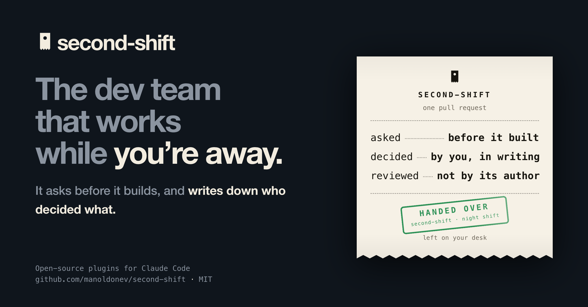

<p align="center">
  
</p>

# second-shift

> The dev team that works while you’re away.
>
> *It asks before it builds, and writes down who decided what.*

Hand it a ticket and go do something else. Before it writes a line, it asks you the open design questions and writes your answers down. Then it builds the change into a pull request, and a separate session, one that did not write the code, reviews it against your answers and leaves its verdict on the PR. You come back to a PR and a recommendation. Merging is still your call.

## Get started

Setup takes about 10 minutes on a JS repo, where your commands are detected, and a little longer on any other stack, where you type them in. Then a first ticket runs on its own while you do other work.

### 1. Check the prerequisites

- [ ] Claude Code installed and logged in (`claude` opens a session)
- [ ] `gh auth status` is green, with write access to the repo
- [ ] `git`, `jq`, `bash` and `node` on your `PATH` (the review and intake workflows run under node; your stack does not have to be JS)
- [ ] A GitHub repo with Issues turned on (on JIRA, see [the JIRA tracker README](plugins/dev-pipeline/tools/tracker/jira/README.md))
- [ ] You know the repo's real install, lint, typecheck and test commands. Setup detects them for JS package managers and Makefiles; on any other stack you type them in.

### 2. Install

What this adds to your sessions: a log of every tool call under `.claude/audit/`, checks that run before `git commit` (your typecheck among them), and a check on plan-mode exits. The full list is in the note onboard writes, `.claude/SECOND-SHIFT.md`.

```bash
claude plugin marketplace add manoldonev/second-shift
claude plugin install second-shift@second-shift     # once per machine
cd ~/code/your-repo
claude
```

### 3. Onboard the repo

```text
/second-shift:onboard
```

It detects your tracker and commands, asks its questions in one batch (branch prefix, creating the GitHub labels, an optional bot identity, design support if the repo has a UI, and a few optional extras), and shows you the whole config on one screen to accept or edit. Say yes to the labels and take the default on everything else. Then it writes:

- `.claude/second-shift.config.json`: your tracker and commands
- `.claude/settings.json` and `.claude/second-shift.lock.json`: the plugins, pinned to a release
- `.claude/tools/second-shift-doctor.sh`: a session-start check that tells teammates when a plugin is missing
- `.claude/SECOND-SHIFT.md`: a plain note on what gets installed, for whoever clones the repo next

It ends by printing one `claude plugin install <plugin>@second-shift --scope project` line per plugin you still need. Run them in your shell (or prefix each with `!` at the Claude prompt), then **restart Claude Code**: plugins load at session start.

Every run starts in a fresh checkout with no `node_modules` or `.venv`, so the config needs an install step. On the review screen it is a commented-out `lanes` line (for example `npm ci`): uncomment it before you accept. If your stack was not detected, the commands are all `null` too; fill them in. Both are a few lines: [onboarding.md → Finish the command table](docs/onboarding.md#finish-the-command-table-and-give-it-a-setup-step).

Commit the files it wrote in one PR, and add `.claude/pipeline-state/` and `.claude/audit/` to `.gitignore` in it: that is where intake and the run keep their working files. **Merge the PR before step 8.** Each run works in a fresh checkout of your default branch, so the plugin settings must already be there.

### 4. Check the install

```text
/second-shift:doctor
```

Every FAIL line prints the command that fixes it; run it again until there are none. WARN lines are advice. On the machine where you ran step 2, expect one: your own marketplace registration has no pinned release, which affects only that machine.

### 5. Pick a first ticket

A small bug or feature already filed as a GitHub issue: one or two files, covered by your existing tests, no new infrastructure, no migrations, no UI design. Adding input validation with a test, or fixing an off-by-one error, is the right size. Write it the way you would for a colleague: what happens now, what should happen, and where in the code.

### 6. Answer its open questions

```text
/intake-toolkit:intake 42
```

Intake reads the ticket and the code, then puts each open design decision to you one at a time, usually with a recommended answer grounded in the code. Your answers become the **intake record** (`.claude/pipeline-state/42-ledger.md`): what was decided, and by whom. The build works from it and the review checks the code against it.

Before the questions, it offers an extra research pass that can take up to 30 minutes. On a first try, pick **Skip it for this ticket**.

### 7. Queue the ticket

Only you queue a ticket; intake does not. Add the `ready-for-dev` label, and optionally a sizing label that picks the build model (`sonnet` for routine work, `opus` for harder work; without one, the run picks and notes that the choice was its own):

```bash
gh issue edit 42 --add-label ready-for-dev --add-label sonnet
```

### 8. Run it

```text
/dev-pipeline:run 42 --dry-run
/dev-pipeline:run 42
```

The dry run changes nothing and prints the branch, the worktree and the checks it would use. A clean dry run does not check the labels, so the real run can still stop on them.

The real run takes the ticket and works in a separate checkout at `../your-repo-worktrees/42`. Its first commit is your intake record, at `docs/plans/your-repo-42-decisions.md`. Each round, a fresh build session writes code and opens or updates a **draft** PR, second-shift runs your checks itself, and a fresh review session posts one PR comment that starts with `verdict: approve` or `verdict: needs-work` and scores every decision in the record. A `needs-work` verdict starts another round; an approve marks the PR ready for review. Don't push to the run's branch while it works: a review only counts for the commit it read.

The build and review sessions run without permission prompts, inside that checkout, with a fixed tool list: file edits, `git`, a few `gh` PR and issue commands, and the program each of your check commands starts with (for `yarn test`, that is `yarn`).

By default a round's build is capped at 2 hours and its review at 1 hour. A run is capped at 3 rounds and 100 USD of session cost as Claude Code reports it; on a subscription that figure is accounting, not a bill (`run` in the config, or `RUN_COST_CEILING`, changes the caps).

The run is detached: you can close Claude Code. It prints the path of its log, `.claude/pipeline-state/42-lean-run-<time>.log`. The log's `terminal: <reason>` line is the outcome, and `terminal: approved` means the PR is ready for you; the last line is `detached run exited rc=<n>`. Each session's own output is under `.claude/pipeline-state/run-42/`.

It never merges. That stays yours.

### Prefer to steer it yourself?

Same steps 1–7, then build in your own session instead of an unattended one:

```text
/dev-pipeline:build 42
```

It does the same setup as a run (takes the ticket, cuts the worktree, commits your intake record), then hands you the build prompt the unattended session would have received. When it asks, type `/add-dir` with the worktree path it printed, so edits there don't prompt. You build and steer; if you change course from a recorded decision, that change is written into the record. When the PR is open, review it from a **fresh** session, so the reviewer isn't the session that wrote the code:

```text
/dev-pipeline:review <pr>
```

An approve marks the PR ready for review. What you give up: second-shift does not re-run your checks, apply its caps, or loop rounds on this path. Making the checks green is yours.

### If something goes wrong

| You see | What it means | Fix |
| --- | --- | --- |
| `Unknown skill` | Plugins were installed mid-session | Restart Claude Code |
| `you're missing your accelerators` at session start | A pinned plugin is not installed | Run the printed install command, or `/second-shift:doctor` |
| `terminal: env-no-record` | No intake record for the ticket | `/intake-toolkit:intake 42` |
| `terminal: not-queued` | No `ready-for-dev` label | `gh issue edit 42 --add-label ready-for-dev` |
| `terminal: not-queued`, naming a blocker label such as `epic` | Someone marked the ticket not ready | Ask whoever added the label; don't just remove it |
| `terminal: env-branch-prefix` | No branch prefix configured | Set `tracker.branchPrefix` in the config (onboard normally does) |
| `terminal: checks-red-spent` | Your checks kept failing | Read the failing check's log under `.claude/pipeline-state/run-42/`. Usually a missing install step, a wrong command, or every command still `null` |
| `terminal: review-unbound` | The review left no usable verdict | `/dev-pipeline:review <pr>` from a fresh session |
| `terminal: claimed-elsewhere` | Someone else holds the ticket | Stop and ask who; `--resume` takes it over |

Any other stop explains itself on the line just above `terminal:`, and a claimed ticket gets the same reason as a comment.

## Plugins

| Plugin | What you get |
| --- | --- |
| **intake-toolkit** | `/intake-toolkit:intake`: the questions before the build, written into the intake record. |
| **dev-pipeline** | `/dev-pipeline:run`: a ticket to a reviewed PR. `/dev-pipeline:review`: a review by hand. |
| **review-toolkit** | The reviewers. A pipeline round runs the scope reviewer; security, accessibility and test-mutation reviewers are opt-in. |
| **design-toolkit** | Builds screens faithful to a Claude Design or Figma handoff. Offered when the repo has a UI. |
| **audit-toolkit** | A per-repo log of the tools the agent actually called, with `/audit-toolkit:audit`. |
| **second-shift** | `/second-shift:onboard` and `/second-shift:doctor`. Installed once per machine. |

## Design principles

- **Runs on your subscription, on your machine.** Nothing needs API-billed cloud services.
- **The session that writes the code never reviews it.** The verdict comes from a fresh session, and nothing merges its own PR.
- **Checks are run, not reported.** second-shift runs your checks itself after every build.

## Docs

[`onboarding.md`](docs/onboarding.md) · [`team-rollout.md`](docs/team-rollout.md) · [`config-schema.md`](docs/config-schema.md) · [`extension-points.md`](docs/extension-points.md) · [`migrations/`](docs/migrations/README.md) · [`CHANGELOG.md`](CHANGELOG.md)

## License

MIT
